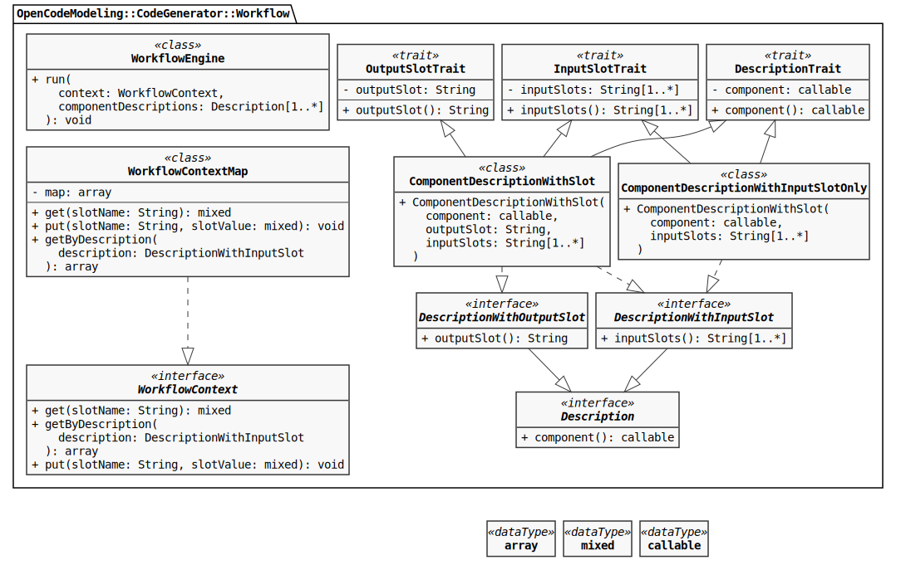
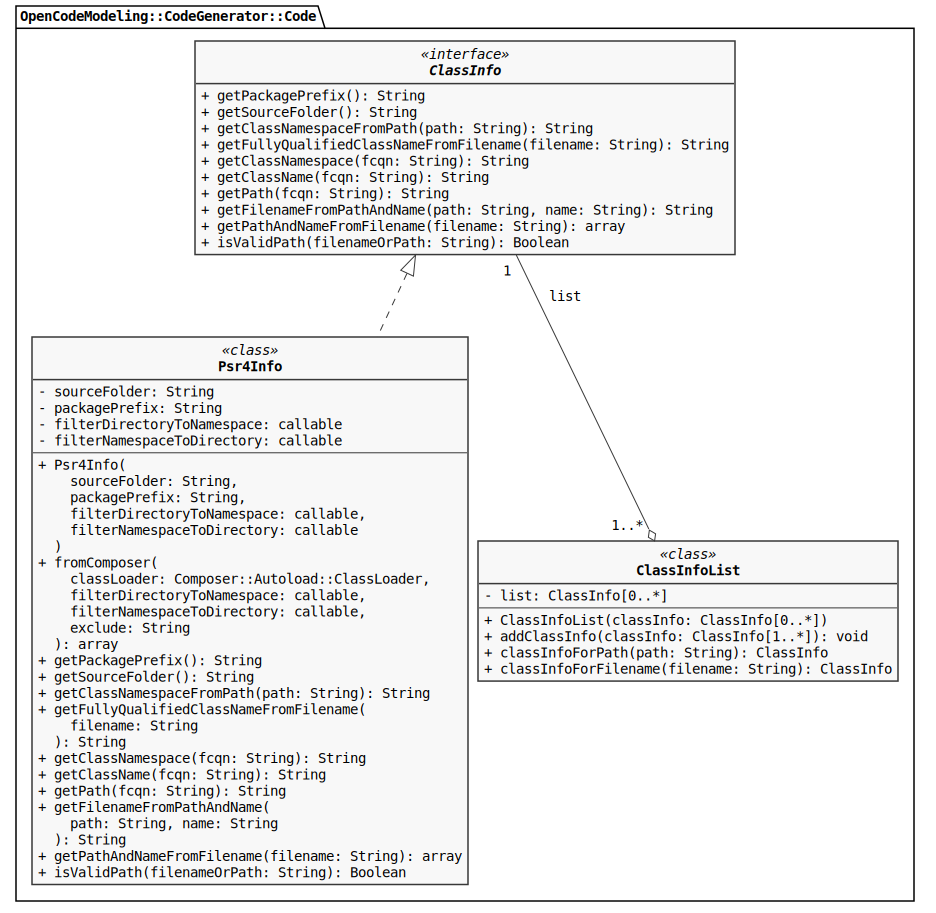
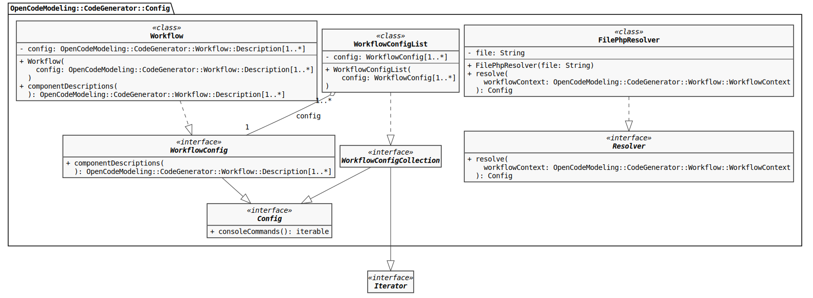
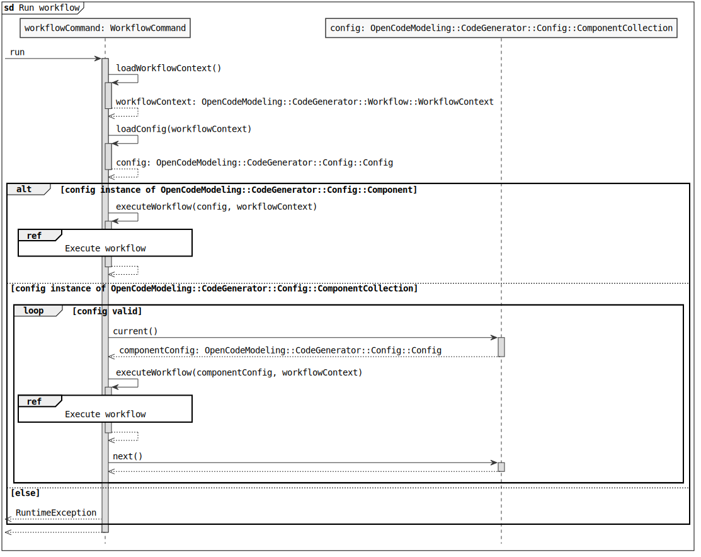
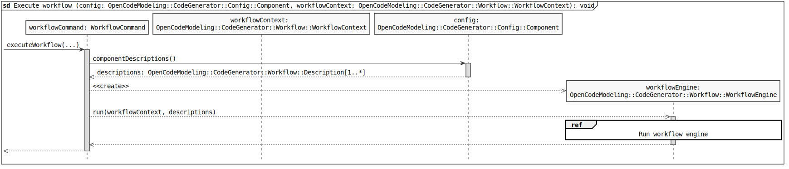
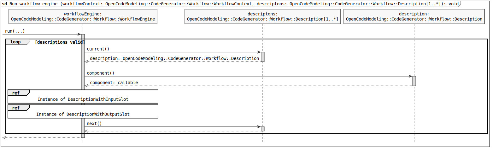
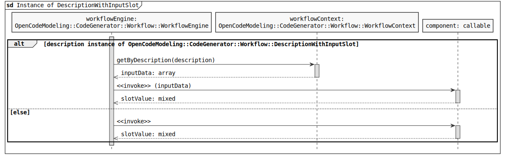
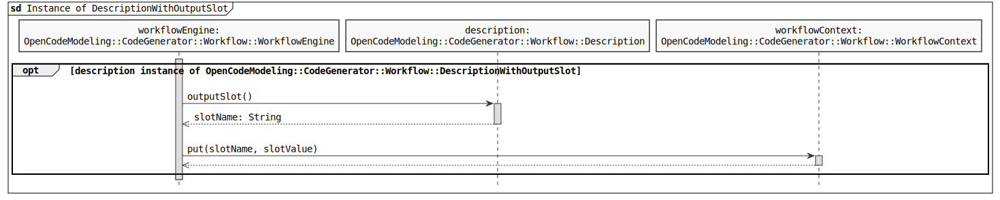

# Generator

The code generator provides the runtime environment for various components. These can be interconnected via a 
configuration. Thus, individual operational sequences can be provided and combined. By this modular structure the code 
generator can be individually extended and configured by developers.

The library consists of four subpackages. These define the runtime environment for the code generation. 
The subpackage `Workflow` is responsible for processing the individual workflows. The configuration of the runtime environment
takes over the subpackage `Config`. The configuration is read from the subpackage `Console` via a command line interface. 
The `Code` subpackage contains classes for file and namespace resolution.

## Workflow

The figure beneath shows the classes from the `Workflow` package. The class `WorkflowEngine` processes a list of 
classes in a specified order which implement the `Description` interface. The processing is started by the `run()` method. 
The first parameter `workflowContext` is of type `WorkflowContext`. The second parameter `componentDescriptions` is a list 
of objects of type `Description`. A standard implementation of the `WorkflowContext` interface is the class 
`WorkflowContextMap`. It allows to manage the input and output data of the individual components. The `get()` method 
provides associative access to the respective slot data. The `slotName` parameter is of type `String` and corresponds 
to the slot name under which the desired slot data can be found. The `put()` method stores the slot data. The first 
parameter `slotName` of type `String` corresponds to the slot name, under which the data can be  retrieved later. The 
second parameter `slotValue` of type `mixed` corresponds to the slot data to be stored. The slot data is stored in the 
`map` attribute under the given slot name. The `getByDescription()` method returns all input data required for calling 
a component from the `WorkflowContext` object. The parameter description is of the type `DescriptionWithInputSlot`. The 
return value is of type `array`.

Several interfaces are available for the description of a component. The interface `Description` must be implemented 
by all classes that describe a component for the code generator. The `component()` method returns the component. A 
component can be a function or a class. This is indicated by the pseudo-type `callable`. If a component is defined as a 
class, it must provide a `__invoke()` method. This method is automatically executed when an object is called as a function. 
An interface is not possible here because the components can have different input parameters and otherwise there would 
be no function support. The `DescriptionWithInputSlot` interface is available for the description of required input data. 
The `inputSlots()` method returns a list with slot names for the required input data when the component is called. The 
`DescriptionWithOutputSlot` interface is available for describing the output data. The `outputSlot()` method returns the 
slot name under which the output data of the component is stored. The two interfaces `DescriptionWithInputSlot` and 
`DescriptionWithOutputSlot` can be used to describe components that have only input or only output data. Since components 
usually have both input and output data, there is the class `ComponentDescriptionWithSlot`. The constructor has three 
parameters. The first parameter `component` is of type `callable` and corresponds to the component to be executed. The 
second parameter `outputSlot` is of type `string` and corresponds to the slot name under which the output data is 
stored. The third parameter `inputSlots` is a list of element type `String` and contains the slot names for the required input 
data of the component. The `ComponentDescriptionWithSlot` class inherits from the `DescriptionTrait`, `InputSlotTrait` and 
`OutputSlotTrait` classes. These classes each provide the methods for the implemented interfaces. For components with 
input data only, there is the class `ComponentDescriptionWithInputSlotOnly`. This inherits from the classes 
`DescriptionTrait` and `InputSlotTrait`.

## Code

The figure beneath shows the classes from the package `Code`. To generate classes it is necessary to know the package, 
the namespace and the file path. The `ClassInfo` interface defines the necessary methods. The `getPackagePrefix()` method 
returns the package prefix. This is prefixed to every class name. The `getSourceFolder()` method returns the path to the 
code directory. The `getClassNamespaceFromPath()` method is used to determine the namespace using the passed path. The 
`getFullyQualifiedClassNameNameFromFilename()` method returns the class name including namespace based on the file name. 
The `getClassNamespace()` method returns the class namespace from FQCN. The `getClassName()` method returns the class 
name from FQCN. The `getPath()` method returns the path which is extracted from class name by using package prefix and 
source folder. The `getFilenameFromPathAndName()` method returns the file name based on the passed path and name. The 
`getPathAndNameFromFilename()` method returns the path and name as a list based on the passed file name. The 
`isValidPath()` method checks whether the passed path or file name belongs to this namespace or package.

A standard implementation of the `ClassInfo` interface is provided by the class `Psr4Info`. The constructor 
has four parameters. The first parameter `sourceFolder` is of type String and corresponds to the path of the code directory. 
The second parameter `packagePrefix` is of type String and corresponds to the package prefix. The third parameter 
`filterDirectoryToNamespace` is of type callable and a filter for the conversion of a directory path into a namespace. 
The fourth parameter `filterNamespaceToDirectory` is of type callable and a filter for the conversion of a namespace into 
a directory path. Using the static `fromComposer()` method, an instance of the class `Psr4Info` will be created based 
on the Composer configuration. Composer is a package manager for PHP. The first parameter `classLoader` is of type `ClassLoader` 
from the external package `Composer::Autoload`. The third parameter `filterDirectoryToNamespace` is of type callable 
and a filter for the conversion of a directory path into a namespace. The fourth parameter `filterNamespaceToDirectory` 
is of type callable and a filter for the conversion of a namespace into a directory path. The fourth parameter `exclude` 
is of type String and specifies which path should be ignored. The class `ClassInfoList` stores a list of objects of 
type `ClassInfo` in the attribute `list`. These are passed to the constructor. More can be added using the 
`addClassInfo()` method. The `classInfoForPath()` method returns the appropriate `ClassInfo` object based on the 
provided path. The `classInfoForFilename()` method returns the matching `ClassInfo` object based on the provided filename.

## Config

The figure beneath shows the classes from the package `Config`. The code generator supports different 
types of configuration via the interface `Config`. The `consoleCommands()` method can return a list of CLI commands for 
the code generator CLI. The `WorkflowConfig` interface is available for the configuration of components. It implements the interface 
`Config`. The descriptions of the components can be retrieved using the `componentDescriptions()` method. The return 
value is a list with element type `Description` from the package `Workflow`. A standard implementation of the 
`WorkflowConfig` interface is realized by the class `Workflow`. The constructor expects a list with element type 
`Description` from the package `Workflow`. Several workflows can be combined via the `WorkflowCollection` interface. 
It implements the interfaces `Config` and `Iterator`. The interface `Iterator` allows the iteration via individual 
component descriptions. A standard implementation of the interface `WorkflowCollection` is realized by the class 
`WorkflowList`. The constructor expects a list with element type `WorkflowConfig`.

To be able to read the configuration from different sources, the interface `Resolver` exists. This interface defines the 
`resolve()` method with a parameter. The parameter `workflowContext` is of type `WorkflowContext` from the package 
`Workflow`. The input parameter `workflowContext` can be used by the respective configuration to provide necessary data 
for starting the code generation. The return value is of type `Config`. A standard implementation of the `Resolver` 
interface is realized by the class `FilePhpResolver`. The path to the configuration file is passed to the constructor 
and stored in the `file` attribute. When the `resolve()` method is called, this file is read in and the corresponding 
configuration is returned to the caller.

## Console

To execute the code generator, a command line interface is available in the package `Console`. The figure beneath shows the
procedure for starting the code generator. You can see a `workflowCommand` object of the type `WorkflowCommand`. First, 
the `loadWorkflowContext()` method of the `workflowCommand` object is called. This returns an object of type 
`WorkflowContext` from the package  `Workflow` back. The return value is stored in the local attribute 
`workflowContext`. Next, the `loadConfig()` method of the `workflowCommand` object is called. As argument the local 
attribute `workflowContext` is passed to it. The return value of this method is an object of type `Config` from the 
package `Config`. This is stored in the local attribute `config`.

The following checks what type of configuration the local config attribute is. If this is the type `WorkflowConfig` 
from the package `Config`, the `executeWorkflow()` method of the `workflowCommand` object is called. The local 
attributes `config` and `workflowContext` are passed to it in the listed order. This method is described in detail in the 
interaction reference *Execute Workflow*. If the local attribute `config` is of type `WorkflowCollection` from the package 
`Config`, iteration is first performed over this attribute. At the beginning of each loop pass, the current object is 
fetched from the list and stored in the local attribute `workflowConfig`. Next, the `executeWorkflow()` method of the 
`workflowCommand` object is called. This will call the local attribute `workflowConfig` of the current loop pass and the 
local attribute `workflowContext` in the listed order. At the end of each iteration the internal pointer is set to the 
next element in the list. The iteration is done until there is no next element in the list. If the local attribute 
`config` is neither of type `WorkflowConfig` nor `WorkflowCollection`, an exception is raised via the `RuntimeException` class.

How to start the workflows is shown in the figure beneath. The `executeWorkflow()` method of the `workflowCommand` object 
first calls the `componentDescriptions()` method of the `config` object. The return value is a list of objects of type 
`Description` from the package `Workflow` and is stored in the local attribute `descriptions`. Next, a 
`workflowEngine` object of type `WorkflowEngine` from the package `Workflow` is created. Afterwards, the `workflowCommand` 
object calls its `run()` method. The `workflowContext` object and the local attribute `descriptions` are passed to this 
method in the listed order. This method is described in detail in the interaction reference *Run workflow engine*.

The figure beneath shows the processing of the working steps. First, the list of the input parameter `descriptions` is 
iterated. At the beginning of each loop pass, the current description object is fetched from the list and stored in the 
local attribute `description`. The `workflowEngine` object next calls for each `description` object its `component()` method. 
The result is a `component` object, which is stored in the local attribute `component` and called later. Afterwards, it is 
checked whether the `description` object is of the `DescriptionWithInputSlot` type. This is described in more detail in 
the interaction reference *Instance of DescriptionWithInputSlot*. The next step is to check whether the description 
object is of type `DescriptionWithOutputSlot`. This is described in detail in the interaction reference 
*Instance of DescriptionWithOutputSlot*. At the end of each iteration the internal pointer is set to the next element 
in the list. The iteration is done until there is no next element in the list.

The figure beneath shows the process if the description object is of type `DescriptionWithInputSlot` from the package 
`Workflow`. In this case, input parameters are required when calling the local attribute `component`. Therefore, the 
`workflowEngine` object calls the `getByDescription()` method of the `workflowContext` object. The local attribute 
`description` is passed as argument to this method. Based on this, a list with the necessary input data is returned 
from the `workflowContext` object and stored in the local attribute `inputData`. Next, the local attribute `component` is 
called. The UML stereotype *<<invoke>>* indicates that the local attribute `component` is called like a function. Each 
element in the list of the local attribute `inputData` is passed as one argument. This allows, despite the dynamic call, 
the definition of parameters with corresponding types for the `__invoke()` method in the respective class or for a 
function. The return value is stored in the local attribute `slotValue`. If the description object is not of type 
`DescriptionWithInputSlot`, the local attribute `component` is called without any arguments. The return value is stored 
in the local attribute `slotValue`.

The figure beneath shows the process, if the description object is of type `DescriptionWithOutputSlot` from 
the package `Workflow`. The `outputSlot()` method of the `description` object is called here. The return value is the slot 
name under which the data is stored in the `workflowContext` object. This is stored in the local attribute `slotName`. 
Next, the `put()` method of the `workflowContext` object is called. The local attributes `slotName` and `slotValue` are 
passed to it in the listed order.

